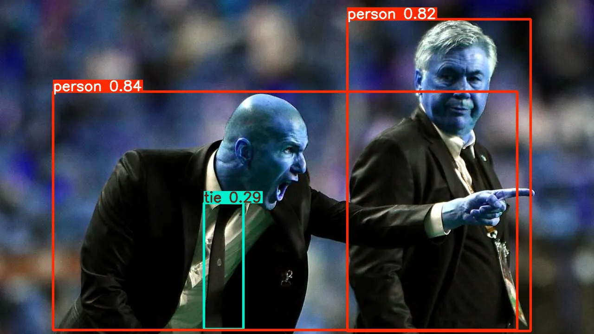

# YOLOv8-Batch-Object-Detection

Detect objects in multiple images using the latest YOLOv8 model with just a few lines of Python. This project is optimized for Google Colab and can be easily adapted for local use.

## Features

- Batch object detection on images in a folder
- Uses Ultralytics YOLOv8 (pretrained)
- Saves results with bounding boxes and class labels
- Minimal, efficient, and easy to use

## Getting Started

### 1. Run on Google Colab

[](https://colab.research.google.com/)

- Upload your images to the `/content/images` folder.
- Run the notebook cells.
- Annotated images will be saved in `/content/results`.

### 2. Local Usage

- Clone this repository
- Install dependencies:  
  ```bash
  pip install ultralytics
  ```
- Place your images in the `images` folder.
- Run the script:
  ```bash
  python batch_detect.py
  ```

## Example

| Input Image | Output (Detected) |
|-------------|-------------------|
|  |  |

## Hosting a Web Demo

🧠 Try it on Hugging Face: [YOLOv8 Object Detection Demo](https://huggingface.co/spaces/Jamil786786/yolov8-object-detection)

## License

MIT License

---

## 2. **Free Web Demo Hosting**

The fastest and most hassle-free way is to use [Hugging Face Spaces](https://huggingface.co/spaces) with [Gradio](https://gradio.app/):

### **Why Hugging Face Spaces?**
- Free for public projects
- No credit card required
- Easy to deploy with Gradio UI
- Supports file upload and instant inference

---

### **How to Deploy on Hugging Face Spaces**

1. **Create a `app.py` file:**

````python
import gradio as gr
from ultralytics import YOLO

model = YOLO('yolov8n.pt')

def detect(image):
    results = model(image)
    return results[0].plot()  # Returns annotated image

gr.Interface(
    fn=detect,
    inputs=gr.Image(type="pil"),
    outputs=gr.Image(type="pil"),
    title="YOLOv8 Object Detection",
    description="Upload an image to detect objects using YOLOv8."
).launch()
